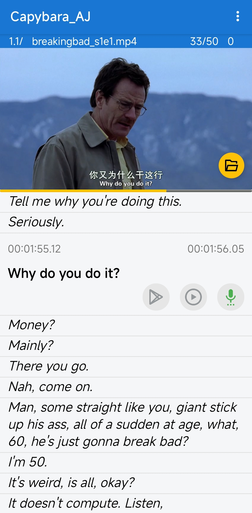

# Capybara_AJ

Capybara_AJ是一个为学习语言口语而设计的Android应用。

它使用srt/ass字幕文件和视频文件，以创造一个模仿口语的环境。
其外观如下文图片所示。

点击字幕时，视频的相应句子会被播放。
你还可以录制你的模仿，与视频的句子进行对比。
它还可以生成视频的配音版本，以通篇播放你的配音。

要使用它，请先在手机上安装该应用程序，
然后在SD卡根目录创建一个名为“CPBRs”的文件夹，将视频文件和srt文件放入其中（它们
必须具有相同的basename），
如果你想使用配音功能，你需要先使用Spleeter生成单独的音轨。

CPBR的结构如下：
```
SDCARD/CPBRs
    ---VIDEO_DIR
        ---xyz.mp4
        ---xyz.srt
    ---dubbing
        ---xyz
            ---accompaniment.mp3
            ---vocals.mp3
```

Capybara_AJ is an Android App designed for learning language speaking. 

It uses srt/ass subtitle files and video files, to enable a imitation environment.
The snapshot following shows how it looks like.

When the subtitle is clicked, the corresponding sentence of the video will be replayed.
You can also record your imitation, to compare with the original line.
It can also generate the dubbing version of the video, to show how your imitations sounds like.

To use it, install the app on your phone first, 
then create a fold in SD card root directory named "CPBRs", put the video file and srt file in it(they 
have to have the same base name),
if you want to use dubbing feature, you need spleeter to generate separated tracks first.

The structure of CPBRs is like this:
```
SDCARD/CPBRs
    ---VIDEO_DIR
        ---xyz.mp4
        ---xyz.srt
    ---dubbing
        ---xyz
            ---accompaniment.mp3
            ---vocals.mp3
```


